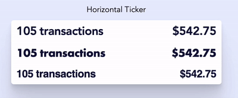
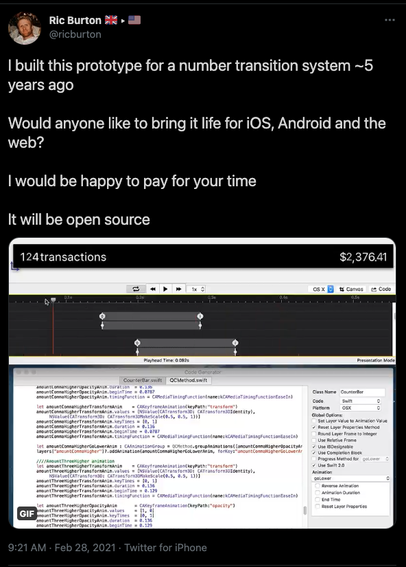

# Horizontal Ticker

A ticker that updates horizontally instead of vertically.

## Example

[Demo link](https://horizontal-ticker.vercel.app/)



(gif is potato quality, go to demo site)

## Usage

### Install

`yarn add horizontal-ticker-react`

### Use

```tsx
import { Ticker } from 'hotizontal-ticker-react'

const Example = () => {
  // Format number exactly how you want before passing to ticker
  const accountBalance = '$1234.56'

  return (
    <>
      // Basic usage
      <Ticker n={accountBalance} />
      // ... All the bells and whistles:
      <Ticker
        fontFamily={'Helvetica'}
        fontSize={32}
        align={'left'}
        n={accountBalance}
        alignLeftComponentAfterNumber={' transactions'}
      />
    </>
  )
}
```

## Source

Inspired by [Ric's tweet](https://twitter.com/ricburton/status/1366030652722806788)



## Tech

Built by John Johnson. Powered by tsdx.
